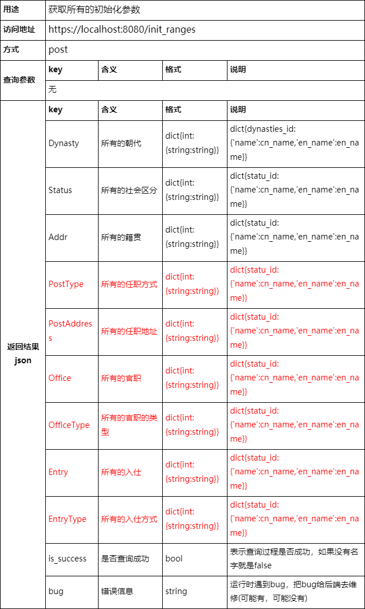

# 数据库部分
## 环境
1. neo4j
## 导入数据
```bash
neo4j-admin load --from=./dataset/graph_cbdb2_1.dump --database=graph.db --force
neo4j-admin load --from=./dataset/graph_cbdb2_2.dump --database=graph.db --force
```
## 启动neo4j数据库
neo4j.bat console
## 连接账户密码
connect URL: bolt://localhost:7687
Username: neo4j
Password: 123456

# 后端部分
## 环境
推荐使用 anaconda 安装所需要的包
所需要的包全在requirement.txt
## 运行后台
```bash
python manage.py runserver 127.0.0.1:8001
```

# 前后端接口



# 后端自测接口


# 后端框架介绍
## dataset 存放所有的数据集
`build_dataset.py` 将neo4j图数据库转化成litesql来快速读取数据
`graph.db` litesql生成的库
## group_anaysis django框架部分
`__init__.py` 一个空文件，告诉 Python 该目录是一个 Python 包。
`settings.py` 该 Django 项目的设置/配置
`urls.py` 匹配请求的url和对应处理的接口
`view.py` 后端接口部分，里面主要是处理请求的数据是否符合规则，具体业务逻辑在services里
`wsgi.py` 一个 WSGI 兼容的 Web 服务器的入口，以便运行你的项目。
## images 里面存放readme里所有要展示的图片
## services 提供具体业务逻辑
`common.py` 里面包含所有常量类和常量数据
`dao.py` 负责与数据库直接接触，包含了所有的基础查询语句
`sevice.py` 业务逻辑实现部分
### configs 所有的配置文件
`labels.yaml` 里面存放着所有图数据的Labels标签
`meta_paths.yaml` 里面存放着所有配置的元路径
### model 所有的实体类
`meta.yaml` 里面包含元点和元路径实体类，可以根据`meta_paths.yaml`来自己配置所有的元路径
## templates 存放后端自测页面(post请求测试)
`test_post.html` 测试post请求的页面
## utils 存放所有工具
`yaml_utils.py` 读写yaml文件的工具类
## _test_service.py 测试所有的业务逻辑类(测试算法)
## manage.py 后端运行入口
## requirement.txt 运行环境所需要的全部包
