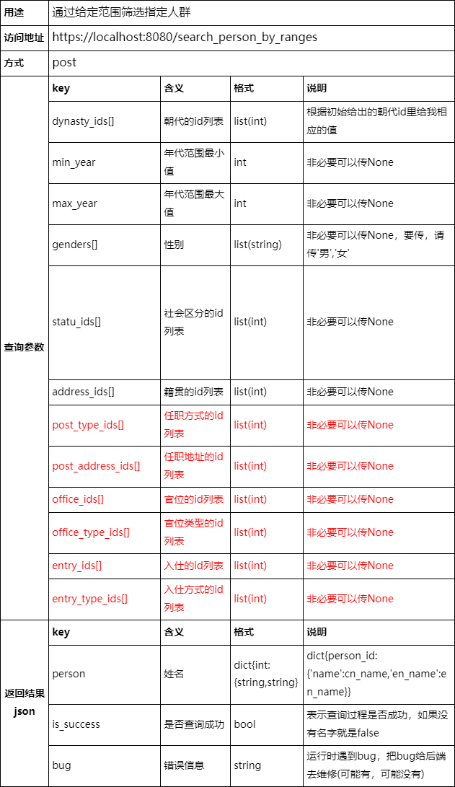
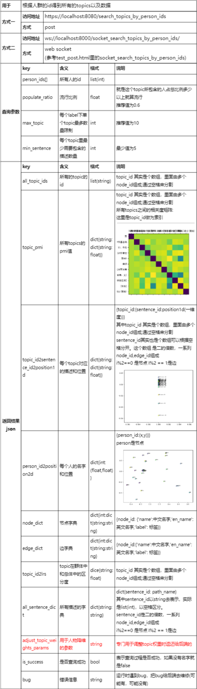

# 更新 2020/3/16
将上述算法融入到了后端中。并修改了新的数据库

        链接：https://pan.baidu.com/s/1GNWBW2Aj4RpmmOQll7oTEg 
        提取码：egkz

# 更新 2020/3/4
1. 换了计算节点相关度的计算方式
2. 添加了相似人物推荐的算法(findAllSimPeople函数)，在数据库中添加了新的对应的倒排索引, 新的数据库位置

        链接：https://pan.baidu.com/s/1jSYAhKd9-ikEZbzm7lx2nA (废弃)
        提取码：f9a7

3. 添加LRS(LRS函数)，表示topic在群体中和总体中的区分度,
4. 修改了描述的降维方式，改为了tf-idf,现在不需要加载原先训练好的模型了


# 数据库部分
## 环境
1. neo4j
## 导入数据
```bash
neo4j-admin load --from=./dataset/graph_cbdb4.dump --database=graph.db --force
```
## 启动neo4j数据库
```bash
neo4j.bat console
```
## 连接账户密码
**connect URL:** bolt://localhost:7687

**Username:**  neo4j

**Password:**  123456
## 将neo4j数据库转换成litesql数据库（先连上neo4j的数据库）
```bash
python dataset/build_dataset.py
```

# 后端部分
## 环境
推荐使用 `anaconda` 安装所需要的包

所需要的包全在 `requirement.txt`
## 运行后台
```bash
python manage.py runserver 127.0.0.1:8080
```

# 前后端接口






# 后端自测接口
```
http://127.0.0.1:8080/test_init_ranges/
```

# 后端框架介绍
|— `dataset` 存放所有的数据集

|——— `build_dataset.py` 将`Neo4j`图数据库转化成`Litesql`来快速读取数据

|——— `graph.db` `Litesql`生成的库 [下载](https://pan.baidu.com/s/1nta1-lgHu-YUtZ8SJVqYog) 提取码:dvp0

|——— `CBDB_20190424.db` `Litesql`生成的库 [下载](https://pan.baidu.com/s/1eH04dDlycyl_-uKoYTOQ8Q) 提取码:9loi

|— `group_anaysis` `Django`框架部分

|——— `__init__.py` 一个空文件，告诉`Python`该目录是一个`Python`包。

|——— `settings.py` 该`Django`项目的设置/配置

|——— `urls.py` 匹配请求的`url`和对应处理的接口

|——— `view.py` 后端接口部分，里面主要是处理请求的数据是否符合规则，具体业务逻辑在`services`里

|——— `wsgi.py` 一个`WSGI`兼容的`Web`服务器的入口，以便运行你的项目。

|— `images` 里面存放`README.md`里所有要展示的图片

|— `services` 提供具体业务逻辑

|——— `configs` 所有的配置文件

|—————— `labels.yaml` 里面存放着所有图数据的`Labels`标签

|—————— `meta_paths.yaml` 里面存放着所有配置的元路径

|——— `entity` 所有的实体类

|—————— `meta.yaml` 里面包含元点和元路径实体类，可以根据`meta_paths.yaml`来自己配置所有的元路径

|——— `models` 所有训练好的模型 [下载](https://pan.baidu.com/s/1bV1u2rby8ZWwxrHhd1XAuQ) 提取码：9rb3

|—————— `sentence2vec.model` 训练好的`doc2vec`的模型 

|—————— `sentence2vec.model.docvecs.vectors_docs.npy` 训练好的`doc2vec`的模型

|——— `dao` 负责与数据库直接接触，包含了所有的基础查询语句

|—————— `base_dao.py` 基础的dao(sqlite数据库)

|—————— `cbdb_dao.py` CBDB数据库的dao

|—————— `graph_dao.py` GRAPH的dao

|——— `common.py` 里面包含所有常量类和常量数据

|——— `sevice.py` 业务逻辑实现部分

|— `templates` 存放后端自测页面(`post`请求测试)

|——— `test_post.html` 测试`post`请求的页面

|— `tools` 存放所有工具

|——— `analysis_utils.py` 降维算法分析的工具类

|——— `sort_utils.py` 排序的工具类

|——— `yaml_utils.py` 读写`yaml`文件的工具类

|— `.gitignore` `git`时忽略文档的目录

|— `_test_service.py` 测试所有的业务逻辑类(测试算法)

|— `manage.py` 后端运行入口

|— `requirement.txt` 运行环境所需要的全部包

